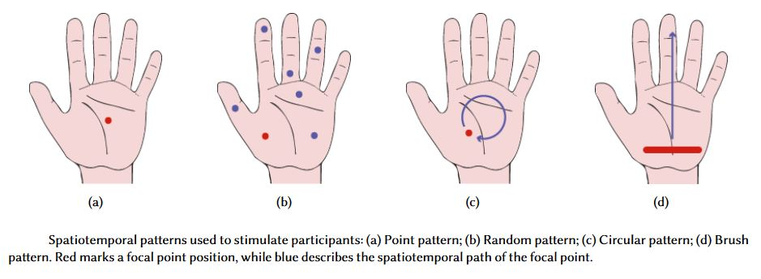

ATHCC - Assignment 3
==============

In the following, we describe how the data found in this repository came to be. We recommend you read it all, although the "Study" section might be read lightly.

If you are interested, you can take a look at these additional resources:
- [Explainer of Mid-Air Haptics](https://video.ku.dk/video/74350420/how-can-ultrasonic-waves-create)
- [Ultrasonic Mid-Air Haptic device, Ultraleap Stratos Explore](https://www.ultraleap.com/product/stratos-explore/)
- [Youtube playlist on "How it works"](https://www.youtube.com/watch?v=tBMkBS_Rlgc&list=PLsvn1uYdbVWqeJWN1M004DWeBKtJb7nw1)

**Table of contents**
- [ATHCC - Assignment 3](#athcc---assignment-3)
- [Study](#study)
  - [Stimulation Parameters](#stimulation-parameters)
  - [Selected Stimuli](#selected-stimuli)
  - [Method](#method)
    - [Participants](#participants)
    - [Methodology](#methodology)
    - [Procedure](#procedure)
    - [Data](#data)
- [Data](#data-1)
- [Caveats](#caveats)
- [References](#references)

# Study

## Stimulation Parameters

We investigate the relation between mid-air haptic stimuli and user experience by using an ultrasonic haptic device.
Due to the large design space of stimuli the ultrasonic haptic device can produce, we have to limit our investigation to a set of stimulation parameters.
Here we describe the design space and explain the set of parameters included in our study.

Each stimulus induced by ultrasonic mid-air haptic devices consists of a set of primary and secondary parameters.
The primary parameters are the focal point intensity and position.
Intensity is in essence the amplitude of the wave emitted by the ultrasound speakers.
In our study, the intensity of the focal point is modulated on a sinusoidal waveform, with a fixed amplitude of the highest possible setting for the used device, approximately 155 dB [^1], [^2].
The focal point position can be modulated by emitting ultrasound from an array of speakers.
Both the amplitude and the focal point can also be modulated over time.
This brings us to a set of secondary parameters. For example, we can vary the frequency of the wave amplitude (how often the wave reaches its full amplitude) or the sequence and tempo in which the focal point is set onto a number of positions.

In our study, we focus on three parameters: amplitude frequency, spatial pattern, and the number of repetitions.
With these parameters, we can build stimuli that have the potential to trigger diverse accusations and experiences.
The parameter settings presented reflect the current common use of mid-air haptic technology, such as feedback for button-presses and interaction with virtual objects [^3]).
Additionally, these parameters are used most often in previous work.

We vary the _frequency_ of the wave amplitude, with values of 16 Hz, 125 Hz, and 250 Hz.
With these frequencies, we target two sets of fast-adapting mechanoreceptors in the human skin, responding to vibrotactile sensations [^4],[^5].
The peak sensitivities of these receptors are around 16 Hz an 250 Hz respectively [^7], leading to the choice of these settings.
A 125 Hz amplitude frequency has the potential to stimulate both sets of receptors, as the activation range of the receptors overlap [^5],[^6].
Additionally, a 125 Hz frequency amplitude modulation was used in the experiments by Rutten et al. [^1].



*21.03.23: Updated figure to match caption and text*

We modulate the position in four different _patterns_. The patterns are inspired by the work of [^1] and [^8].
The figure above shows the patterns.
Except for the Point pattern, they are spatiotemporal patterns in the sense that they have a temporal sequence in which multiple locations are stimulated over time.

- The Point pattern (a) is a statically positioned focal point in the centre of the palm, with a diameter of approximately 0.8 cm (the focal point width).
- The Random pattern (b) is similar to the Point pattern, with the difference that the focal point is stimulating on random positions on the hand (the randomness is controlled).
- The Circle pattern (c) describes a circular path for the focal point, with center in the centre of the palm, and a radius of 2 cm.
- The Brush pattern (d) is a 5 cm wide line moving from the wrist to the fingertips, where the illusion of a line is created by oscillating the focal point with a frequency of 100 Hz.

The stimulus length is fixed to four seconds.
We vary the number of _repetitions_ of the stimulus within this time frame, with values of one, four, and eight.
In practice, this means that when the number of repetitions is four, the pattern is played four times within these four seconds.
Thus, with four repetitions, the pattern is applied for 500 ms and paused for 500 ms, four times in a row.
Patterns are completed exactly once every repetition (e.g., the focal point moves around the circular path once per repetition).
We limit the stimulus length to keep the overall study duration short to counteract any fatigue during the study.
With four seconds, the stimulus is long enough to repeat a pattern multiple times, while being short enough to not induce much fatigue during the overall study.
The repetitions were chosen to represent a stimulus that is constantly on (when the repetition value is one), and a fast on-off stimulus (eight) which is still not that frequently repeated that it would be felt as being constantly on, as well as one value in between (four).

## Selected Stimuli

In a previous study we found five candidate stimulati interesting for further investigation. These stimuli have the following parameters:
| #   | Frequency | Pattern | Repetitions |
| --- | --------: | :-----: | ----------: |
| 1   |    250 Hz | Random  |           8 |
| 2   |    125 Hz | Circle  |           8 |
| 3   |     16 Hz |  Point  |           8 |
| 4   |    250 Hz |  Point  |           1 |
| 5   |    125 Hz |  Brush  |           1 |


## Method

### Participants
We invited 10 participants to talk about their experiences with mid-air haptics.
Of these five were females and five males.
The participants were aged between 21 and 43 (mean: 27.9, std: 5.7).
Three participants reported that they had tried mid-air haptics one or two times before.
There was no overlap between participants participating in the first and second studies.
Five participants currently studied or had completed an education within the STEM fields, three within Arts, two within Social Sciences, and one within Humanities.
All participants spoke in their native language during the study.
None of the participants reported any sensory impairments in the hand. 
Each participant was rewarded with a gift valued at $25.

### Methodology
We use micro-phenomenological approach to conduct the interviews.
Contrary to observational studies, micro-phenomenological studies do not rely on external observations of subjects experiences.
This allows for in-depth questions about the subjective experience to generate rich and precise descriptions.

Petitmengin et al. [^9] crafted the *micro-phenomenology interview* technique based on the work of Vermersch [^10],[^11]. 
The micro-phenomenology interview is a technique for researchers to explore singular subjective experiences in depth.
The interview is meant to focus the interviewee's attention on the experience, guiding them through the evocation of the experience, and directing their attention towards specific dimensions of the experience [^12].
This structure invites interviewees to talk about the different sensory, cognitive, and affective inputs of a specific lived experience.

 
Recently, Prpa et al. [^12] described how the interview technique has been used by HCI researchers. 
They exemplify previous approaches to micro-phenomenology in HCI and provide guidance for researchers using this technique.
In HCI, for instance, Knibbe et al. [^13] used the micro-phenomenological interview to generate descriptions of the moment of exciting Virtual Reality and Hogan et al. [^14] explored information visualizations with the interview technique. 
Obrist et al. [^7] used the micro-phenomenology interview to generate a vocabulary for mid-air haptics.

In the interviews, we ask the participants to describe, relate, and interpret their experiences with different mid-air haptic stimuli.
The analysis of interviews (described by Petitmengin et al. [^15]), is not perfectly suited for our study, because here the experience of a haptic stimulus is relatively short in time.
Therefore, we adapt the questions from Obrist et al. [^7], Petitmengin et al. [^9], Prpa et al. [^12], Obrist et al. [^16], and Knibbe et al. [^17] to suit this type of experience.
The aim of the questions was to uncover three underlying features of the experience: a subjective description, an experiential relation, and an interpretation.
Examples of the questions asked are:

- How would you describe the felt stimulus?
- What previous experience did the stimulus remind you of?
- How would you describe this to someone, who has not tried mid-air haptics at all?
- How was the first time you felt the stimulus different from the last?

In addition to questions, we repeatedly reformulated descriptions given by the participants to stabilize their attention to the experience.
This technique allows the participant to refocus their attention and to correct misunderstandings during the interview ([^9]).

### Procedure
The study was conducted in the same room as in the first study.
The apparatus was also the same as in the first study, although the setup was re-arranged, such that participant and experimenter were sitting across from each other.
This was done to focus the attention of the participant on the interview and stimulus, instead of the apparatus.

The participants were introduced to the aim of the study, signed an informed consent form, and filled out a demographics questionnaire.
Afterwards, they were instructed to wear a set of noise-cancelling headphones playing pink noise during the time a stimulus was induced.
A simple point stimulus was played before starting the interview on the set of stimuli so that the participants had time to familiarise themselves with the sensation of mid-air haptic stimuli.

During this second study, participants were presented with five stimuli. 
The stimuli were presented one at a time in a randomized order to avoid order effects.
Each trial was conducted in two phases: an induction and an interview phase.
During the induction phase, participants felt the stimulus three times in a row with a 5-second delay between playbacks, such that the participant could get a firm impression of the stimulus.
Participants were asked to wear a set of noise-cancelling headphones, playing pink noise, only during this phase.
Immediately after the induction phase, the interview phase started; The interviews followed the micro-phenomenology interview protocol described above and lasted between 5 and 10 minutes for each stimulus.
All interview sessions were audio-recorded.
On average participants completed the full session in 46 minutes.

### Data
We collected recordings of 10 interviews for each of the five stimuli, for a total of 50 stimuli-specific interviews. Together, the interviews span 43,878 words. 
The interviews were transcribed for qualitative analysis.

# Data
In this repository you find the transcribed interviews. Below we list the directory structure.
```
📦interview-data-ATHCC
 ┣ 📂en
 ┃ ┣ 📜[participant].docx
 ┃ ┗ 📜...
 ┣ 📂en-split
 ┃ ┣ 📂[participant]
 ┃ ┃ ┣ 📜[pattern]_[frequency]_[repetitions].txt
 ┃ ┃ ┗ 📜...
 ┃ ┗ 📂...
 ┣ 📜participants.csv
 ┗ 📜...
```
The repositiory contains three important bits of data: ``en``, ``en-split``, and ``participants.csv``.

The ``en`` directory contains a set of Microsoft Word files named after the participant (e.g., "Brahe.docx"). The documents are a bit messy, but generally have the same structure. You will for instance see that an interview block starts with a title formatted in italics: "Stimulus: [*frequency*, *pattern*, *repetitions*]". You do not need to care about text marked in green, but you should look out for the yellow markings, as they are placed by the transcriptor, indicating audio problems, unclear language, and the like.

The ``en-split`` directory contains the same data as the ``en`` directory, but split into several files. This makes reading the data with for instance Python easier. The directory contains several subdirecties named after the participants (e.g., "Turing"). Each of the subdirectory contains five text files containing the interview data, named after the stimulus (e.g., "Circle_125_8.txt"). You should look out for text within angled brackets ("[...]"), as they contain markings by the transcriptor, indicating audio problems, unclear language, and the like. Each line in the text document is preceded by an "I." (interviewer) or "R." (respondent) indicating the person speaking.

The ``participants.csv`` file contains basic demographics on the participants.


# Caveats

The transcripts are naively translated from Danish to English, meaning that there might be a plentora of gramatical errors and oddly translated words. Examples of odd things are listed here:
- The Danish word "fedt" is translated as "fat" but should be translated as "cool".
- The Danish phrase "ik'" (short for "ikke") should be translated as "right" or "no" (as in "You know, right").

Feel free to share fun or stupid examples in your report, on Absalon, or in this repository.

# References

[^1]: I. Rutten, W. Frier, L. Van den Bogaert, and D. Geerts, ‘Invisible Touch: How Identifiable are Mid-Air Haptic Shapes?’, in Extended Abstracts of the 2019 CHI Conference on Human Factors in Computing Systems, New York, NY, USA, May 2019, pp. 1–6. doi: 10.1145/3290607.3313004.
[^2]: T. Howard, M. Marchal, A. Lecuyer, and C. Pacchierotti, ‘PUMAH: Pan-Tilt Ultrasound Mid-Air Haptics for Larger Interaction Workspace in Virtual Reality’, IEEE Trans. Haptics, vol. 13, no. 1, pp. 38–44, Jan. 2020, doi: 10.1109/TOH.2019.2963028.
[^3]: I. Rakkolainen, E. Freeman, A. Sand, R. Raisamo, and S. Brewster, ‘A Survey of Mid-Air Ultrasound Haptics and Its Applications’, IEEE Trans. Haptics, pp. 1–1, 2020, doi: 10.1109/TOH.2020.3018754.
[^4]: A. B. Vallbo and R. Johansson, ‘Properties of cutaneous mechanoreceptors in the human hand related to touch sensation’, Human neurobiology, vol. 3, pp. 3–14, Feb. 1984.
[^5]: G. Corniani and H. P. Saal, ‘Tactile innervation densities across the whole body’, Journal of Neurophysiology, vol. 124, no. 4, pp. 1229–1240, Sep. 2020, doi: 10.1152/jn.00313.2020.
[^6]: G. A. Gescheider, S. J. Bolanowski, and K. r. Hardick, ‘The frequency selectivity of information-processing channels in the tactile sensory system’, null, vol. 18, no. 3, pp. 191–201, Jan. 2001, doi: 10.1080/01421590120072187.
[^7]: M. Obrist, S. A. Seah, and S. Subramanian, ‘Talking about tactile experiences’, in Proceedings of the SIGCHI Conference on Human Factors in Computing Systems, Paris France, Apr. 2013, pp. 1659–1668. doi: 10.1145/2470654.2466220.
[^8]: W. Frier, D. Pittera, D. Ablart, M. Obrist, and S. Subramanian, ‘Sampling Strategy for Ultrasonic Mid-Air Haptics’, in Proceedings of the 2019 CHI Conference on Human Factors in Computing Systems, New York, NY, USA, May 2019, pp. 1–11. doi: 10.1145/3290605.3300351.
[^9]: C. Petitmengin, ‘Describing one’s subjective experience in the second person: An interview method for the science of consciousness’, Phenom Cogn Sci, vol. 5, no. 3, pp. 229–269, Dec. 2006, doi: 10.1007/s11097-006-9022-2.
[^10]: P. Vermersch, L’entretien d’explicitation. Issy-les-Moulineaux: ESF, 1994.
[^11]: P. Vermersch, The explicitation interview. 2018.
[^12]: M. Prpa, S. Fdili-Alaoui, T. Schiphorst, and P. Pasquier, ‘Articulating Experience: Reflections from Experts Applying Micro-Phenomenology to Design Research in HCI’, in Proceedings of the 2020 CHI Conference on Human Factors in Computing Systems, New York, NY, USA, Apr. 2020, pp. 1–14. doi: 10.1145/3313831.3376664.
[^13]: J. Knibbe, J. Schjerlund, M. Petraeus, and K. Hornbæk, ‘The Dream is Collapsing: The Experience of Exiting VR’, in Proceedings of the 2018 CHI Conference on Human Factors in Computing Systems, New York, NY, USA, Apr. 2018, pp. 1–13. doi: 10.1145/3173574.3174057.
[^14]: T. Hogan, U. Hinrichs, and E. Hornecker, ‘The Elicitation Interview Technique: Capturing People’s Experiences of Data Representations’, IEEE Transactions on Visualization and Computer Graphics, vol. 22, no. 12, pp. 2579–2593, Dec. 2016, doi: 10.1109/TVCG.2015.2511718.
[^15]: C. Petitmengin, A. Remillieux, and C. Valenzuela-Moguillansky, ‘Discovering the structures of lived experience’, Phenom Cogn Sci, vol. 18, no. 4, pp. 691–730, Sep. 2019, doi: 10.1007/s11097-018-9597-4.
[^16]: M. Obrist, R. Comber, S. Subramanian, B. Piqueras-Fiszman, C. Velasco, and C. Spence, ‘Temporal, affective, and embodied characteristics of taste experiences: a framework for design’, in Proceedings of the SIGCHI Conference on Human Factors in Computing Systems, New York, NY, USA, Apr. 2014, pp. 2853–2862. doi: 10.1145/2556288.2557007.
[^17]: J. Knibbe, A. Alsmith, and K. Hornbæk, ‘Experiencing Electrical Muscle Stimulation’, Proc. ACM Interact. Mob. Wearable Ubiquitous Technol., vol. 2, no. 3, pp. 1–14, Sep. 2018, doi: 10.1145/3264928.
